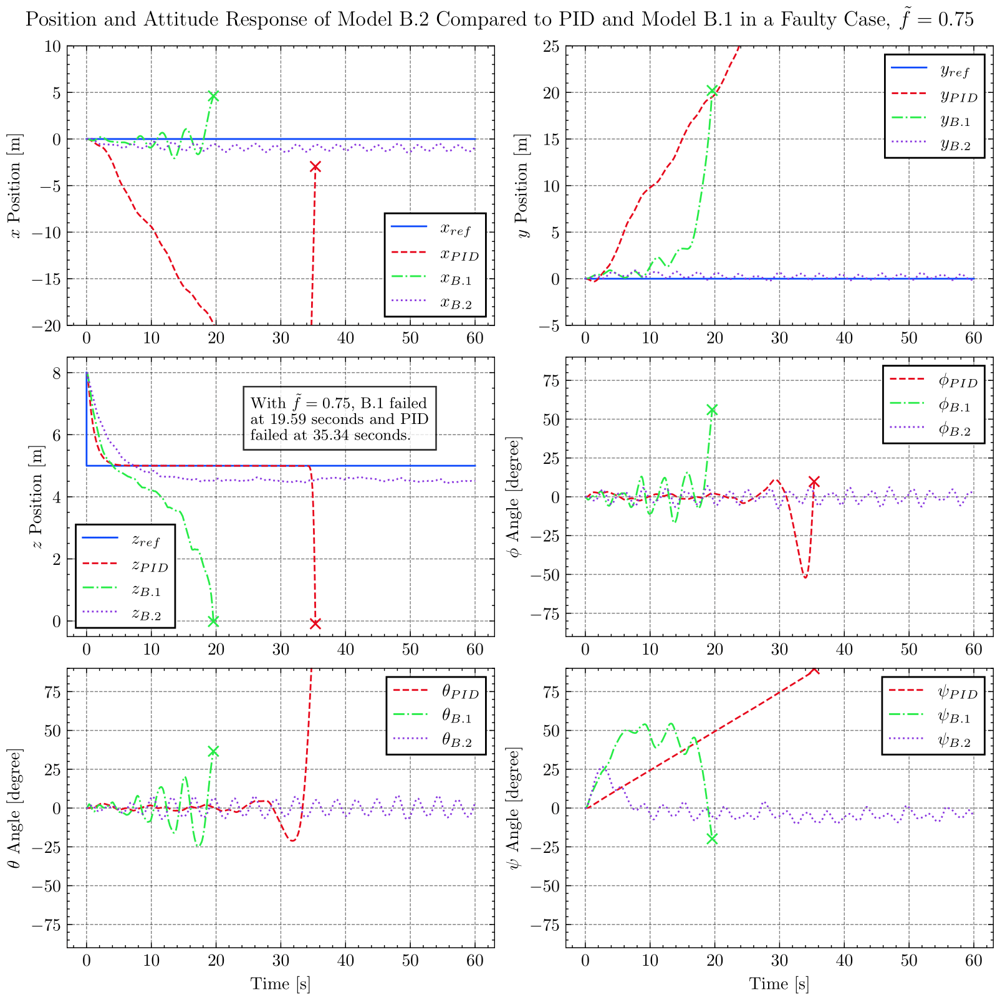

# Fault Tolerant Quadcopter Control using Reinforcement Learning

OpenAI Gym environment for fault tolerant control of a quadcopter using Stable-Baselines3, extended on top of [gym-copter](https://github.com/simondlevy/gym-copter). Repository includes data processing and graphic generation. 
 
## UCL MECH0020: Individual Project

This repository contains all of the code for my 3rd Year MECH0020 project. This was built on top of an existing simulation environment made by Simon D. Levy called [gym-copter](https://github.com/simondlevy/gym-copter). 

I have extended the environment, by developing my own fault model, which allows for a loss of effectiveness to be simulated. I have integrated Stable-Baselines3 into this environment and used the reinforcement learning algorithm PPO to train the model to control the quadcopter in both the nominal case (no faults) and the faulty case (loss of effectiveness in one motor).

I have also integrated a continuous wind disturbance model that allows for a more realistic and complex simulation environment.

### Example Files (Useful for UCL markers)

The [folder](https://github.com/fidhalkotta/gym-copter-FTC/tree/master/example_files) `example_files` contains a few examples of the different aspects of the project. Including the following files:

- `ModelB.2.py` - This is the custom OpenAI Gym environment that I have created. It is based on the `gym-copter` environment, but I have added my own fault model and wind model.
- `trainModelB.2.py` - This is the file that trains the PPO model with StableBaselines3 integration, saving a model periodically.
- `loadModelB.2.py` - This is the file that loads the trained model and visualises the real time simulation, saving the data to a csv file.
- `plot_ModelB.2.ipynb` - This is a jupyter notebook that processes the data from the csv file and generates the graphs used in the report. An example of the graphs generated can be seen below.

## Future Plans

### Immediate Future

- [ ] Clean up code and make it more readable
- [ ] Make repository more open-source friendly
- [ ] Clean and optimise the data processing in jupyter notebooks

### Long Term Future
- [ ] Make the code more modular
- [ ] Add more fault models
- [ ] Add more reinforcement learning algorithms
- [ ] Add more quadcopter models
- [ ] Add more wind models
